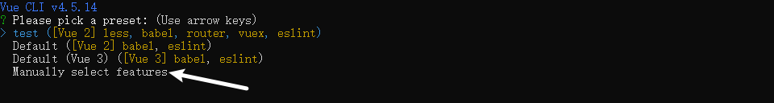
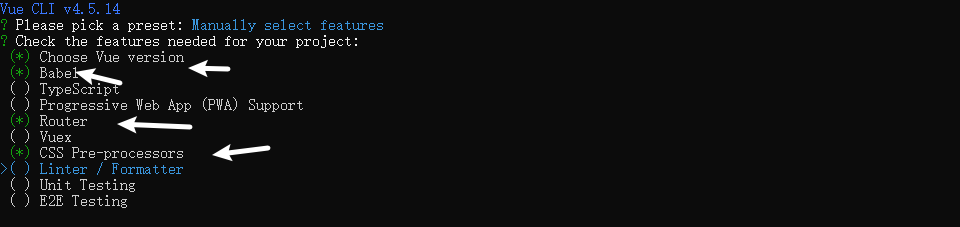
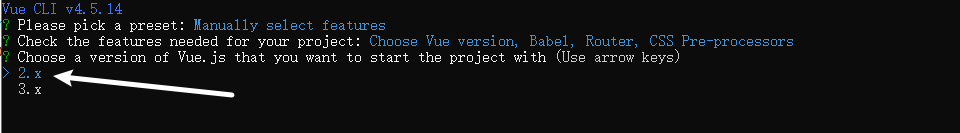
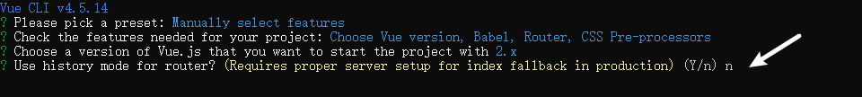
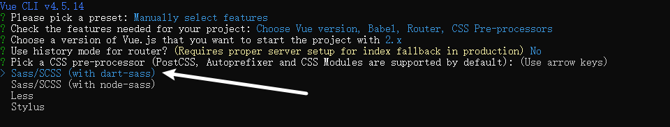
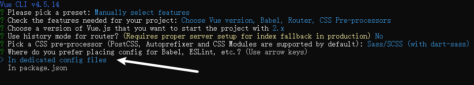
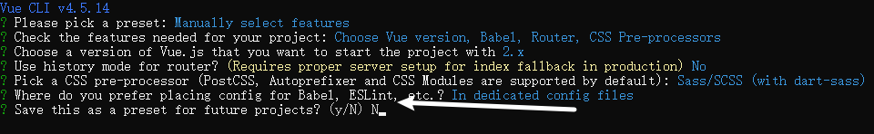

# sell-manage项目开发笔记

# DAY01

## 1 搭建项目环境【重点】

### 1.1 创建项目目录
















### 1.2 清理干净项目&搭建完整目录

- src 工作目录
  - api 接口目录
  - assets 静态资源目录
    - css 重置css，全局css
    - fonts 字体目录
    - imgs 图片
    - scss scss全局配置（颜色变量，mixin）
  - components 通用小组件
  - filters 全局过滤器 
  - router 路由
  - utils 工具函数
  - views 页面组件
  - App.vue 顶级根组件
  - main.js 入口文件

### 1.3 安装iconfont

- 打开iconfont 网站 登录
- 找到自己需要的图标 添加至购物车
- 保持到新项目
- 修改图标的名称
- 下载 解压到 assets/fonts文件夹下面
- 在main.js里面引入

```js
//载入字体图标 @代表src工程文件夹目录
import '@/assets/fonts/iconfont.css'
```

- 找个页面使用一次

### 1.4 引入重置样式reset.css

```js
//引入重置样式
import '@/assets/css/reset.css'
```

### 1.5 安装element-ui

```js
import ElementUI from 'element-ui'; //引入element-ui 组件
import 'element-ui/lib/theme-chalk/index.css'; //引入el的css样式
Vue.use(ElementUI);//注册ElementUI
```


## 2 创建项目组件&配置路由【掌握】

### 2.1 创建页面组件

- 登录 Login.vue
- 布局 Layout.vue
- 后台首页 Home.vue
- 订单管理 Order.vue
- 商品管理 
  - 商品列表 GoodsList.vue
  - 商品添加 GoodsAdd.vue
  - 商品分类 GoodsCate.vue
- 店铺管理 Shop.vue
- 账号管理 
  - 账号列表 AccountList.vue
  - 添加账号 AccountAdd.vue
  - 修改密码 PasswordModify.vue
  - 个人中心 Person.vue
- 销售统计
  - 商品统计 TotalGoods.vue
  - 订单统计 TotalOrder.vue

### 2.2 配置路由

- router/index.js

```js
import Vue from 'vue'
import VueRouter from 'vue-router'

//引入页面级别组件  首屏只加载必要的两个页面级别组件 登录&框架
import Login from '@/views/login/Login.vue'
import Layout from '@/views/layout/Layout.vue'

Vue.use(VueRouter)

const routes = [
  /* 登录 */
  {
    path: '/login',
    component: Login
  },
  /* 后台首页 */
  {
    path: '/',
    component: Layout, //首页的父级是框架
    redirect: '/home',
    children: [ //二级路由 儿子才是自己的组件
      {
        path: '/home',
        component: () => import('@/views/home/Home.vue') //懒加载 ：输入路由地址之后才加载
      }
    ]
  },
  /* 订单管理 */
  {
    path: '/order',
    component: Layout,
    children: [
      {
        path: '',
        component: () => import('@/views/order/Order.vue')
      }
    ]
  },
  /* 商品管理 */
  {
    path: '/goods',
    component: Layout,
    redirect: '/goods/goods-list',
    children: [
      {
        path: '/goods/goods-list', //带【/】地址一定要拼全！！！
        component: () => import('@/views/goods/GoodsList.vue')
      },
      {
        path: '/goods/goods-add',
        component: () => import('@/views/goods/GoodsAdd.vue')
      },
      {
        path: '/goods/goods-cate',
        component: () => import('@/views/goods/GoodsCate.vue')
      },
    ]
  },
  /* 店铺管理 */
  {
    path: '/shop',
    component: Layout,
    children: [
      {
        path: '',
        component: () => import('@/views/shop/Shop.vue')
      }
    ]
  },
  /* 账号管理 */
  {
    path: '/account',
    component: Layout,
    redirect: '/account/account-list',
    children: [
      {
        path: '/account/account-list',
        component: () => import('@/views/account/AccountList.vue')
      },
      {
        path: '/account/account-add',
        component: () => import('@/views/account/AccountAdd.vue')
      },
      {
        path: '/account/password-modify',
        component: () => import('@/views/account/PasswordModify.vue')
      },
      {
        path: '/account/person',
        component: () => import('@/views/account/Person.vue')
      }
    ]
  },
  /* 销售统计 */
  {
    path: '/total',
    component: Layout,
    redirect: '/total/total-goods',
    children: [
      {
        path: '/total/total-goods',
        component: () => import('@/views/total/TotalGoods.vue')
      },
      {
        path: '/total/total-order',
        component: () => import('@/views/total/TotalOrder.vue')
      },
    ]
  },
]

const router = new VueRouter({
  routes
})

export default router
```


### 2.3 测试

- 输入每个地址测试是否成功！

- 一级路由出口 写在根组件App.vue 里面 ！！
- 二级路由出口 写在父级组件内部【此项目 Layout.vue里面】！！

## 4 实现导航组件【掌握】

layout/LeftMenu.vue

```vue
<template>
  <div class="left-menu">
    <!-- logo -->
    <div class="logo">
      
      外卖商家中心
    </div>
    <!-- text-color文字颜色 -->
    <!-- background-color背景色 -->
    <!-- default-active默认激活菜单 -->
    <!--  unique-opened 是否只保持一个子菜单的展开 -->
    <!--router 以 index 作为 path 进行路由跳转 -->
    <el-menu
      text-color="#eeeeee"
      background-color="#304156"
      :default-active="$route.path"
      unique-opened
      router
      class="menu"
    >
      <!--后台首页  -->
      <el-menu-item index="/home">
        <i class="iconfont icon-home"></i>
        <span slot="title">后台首页</span>
      </el-menu-item>
      <!-- 订单管理 -->
      <el-menu-item index="/order">
        <i class="iconfont icon-order"></i>
        <span slot="title">订单管理</span>
      </el-menu-item>
      <!-- 商品管理 -->
      <el-submenu index="1">
        <template slot="title">
          <i class="iconfont icon-goods"></i>
          <span>商品管理</span>
        </template>
        <el-menu-item index="/goods/goods-list">商品列表</el-menu-item>
        <el-menu-item index="/goods/goods-add">商品添加</el-menu-item>
        <el-menu-item index="/goods/goods-cate">商品分类</el-menu-item>
      </el-submenu>
      <!-- 店铺管理 -->
      <el-menu-item index="/shop">
        <i class="iconfont icon-shop"></i>
        <span slot="title">店铺管理</span>
      </el-menu-item>
      <!-- 账号管理 -->
      <el-submenu index="2">
        <template slot="title">
          <i class="iconfont icon-account"></i>
          <span>账号管理</span>
        </template>
        <el-menu-item index="/account/account-list">账号列表</el-menu-item>
        <el-menu-item index="/account/account-add">账号添加</el-menu-item>
        <el-menu-item index="/account/password-modify">修改密码</el-menu-item>
        <el-menu-item index="/account/person">个人中心</el-menu-item>
      </el-submenu>
      <!-- 销售统计 -->
      <el-submenu index="3">
        <template slot="title">
          <i class="iconfont icon-total"></i>
          <span>销售统计</span>
        </template>
        <el-menu-item index="/total/total-goods">商品统计</el-menu-item>
        <el-menu-item index="/total/total-order">订单统计</el-menu-item>
      </el-submenu>
    </el-menu>
  </div>
</template>

<script>
export default {

}
</script>

<style lang="scss" scoped>
.left-menu {
  background-color: $bg;
}
.el-menu {
  border-right: none;
}
.menu {
  width: 200px;
}
.logo {
  display: flex;
  height: 60px;
  padding-left: 10px;
  align-items: center;
  color: white;
  font-weight: 500;
  img {
    margin-right: 5px;
  }
}
.iconfont {
  margin-right: 5px;
}
// ::v-deep 可以穿透子组件的scoped属性 这是scss写法. less 是/deep/
.el-submenu {
  ::v-deep .el-menu--inline {
    .el-menu-item {
      background: darken($bg, 5%) !important;
      &:hover {
        background: darken($bg, 10%) !important;
      }
    }
  }
}
</style>
```

- Attribute属性是用来 传参的

## 5 布局组件拆分

### 5.1 拆分Layout.vue组件成为小组件【同上】

### 5.2 实现右侧头部组件

RightHeader.vue

```js
<template>
  <div class="right-header">
    <!-- 面包屑导航 -->
    <el-row>
      <el-col class="breadcrumb" :span="12"
        ><el-breadcrumb>
          <el-breadcrumb-item :to="{ path: '/' }">首页</el-breadcrumb-item>
          <el-breadcrumb-item><a href="/">活动管理</a></el-breadcrumb-item>
          <el-breadcrumb-item>活动列表</el-breadcrumb-item>
        </el-breadcrumb>
      </el-col>
      <el-col :span="12" class="right">
        <!-- 下拉菜单 -->
        <el-dropdown>
          <span class="el-dropdown-link">
            欢迎你,{{ account
            }}<i class="el-icon-arrow-down el-icon--right"></i>
          </span>
          <el-dropdown-menu slot="dropdown">
            <el-dropdown-item>个人中心</el-dropdown-item>
            <el-dropdown-item>退出登录</el-dropdown-item>
          </el-dropdown-menu>
        </el-dropdown>
        <!-- 头像 -->
        <el-avatar :size="50" :src="avatar"></el-avatar>
      </el-col>
    </el-row>
  </div>
</template>

<script>
export default {
  //数据
  data() {
    return {
      account: '千与千寻',
      avatar: require('../../assets/imgs/logo.png')
    }
  },
}
</script>

<style lang="scss" scoped>
.right-header {
  width: 100%;

  padding: 0 10px;
}
.el-row {
  height: 100%;
}
.breadcrumb {
  height: 100%;
}
.el-col {
  height: 100%;
  display: flex;
  align-items: center;
}
.right {
  justify-content: flex-end;
}
</style>
```


## 6 今日任务

- 完成项目搭建 【√】
- 完成路由划分【√】
- 完成导航组件【√】
- 编写组件
  - 登录
  - 首页
  - 账号部分
  - 商品部分
  - 订单部分
  - 店铺部分
  - **统计部分**