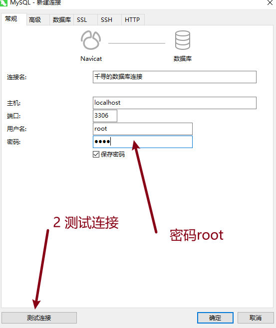
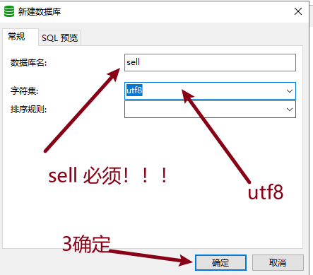
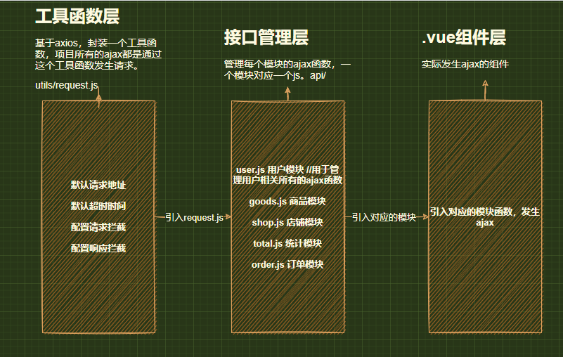

# DAY03

## 0 今日目标

- 表单自定义验证。
- 面包屑导航。
- 封装ajax管理接口。
- 登录接口。

## 1 表单自定义验证

### 1.1 使用方法

```js
export default {
    data(){
        const 校验函数 = (rule, value, callback) =>{
            /*
            rule 表示一个对象 里面有很多东西 rule可用可不用
            value 表单的值
            callback 回调函数 校验成功或失败 必填
            失败 callback(new Error('错误信息'))
            成功 callback()
            */
        }
        
        return {
            rules:{
                校验的字段:[{validator:校验函数,trigger:'触发方式'}]
            }
        }
    }
}
```

### 1.2 登录自定义验证

- Login.vue

```js
<template>
  <div class="login">
    <!-- 登录表单 -->
    <div class="form">
      <div class="title">
        
        系统登录
      </div>
      <!-- 表单组件 -->
      <!-- size属性控制整个表单控件的大小 -->
      <!-- model属性绑定表单数据 -->
      <!-- rules表单验证规则 -->
      <!-- status-icon反馈验证图标 -->
      <el-form
        :rules="rules"
        ref="form"
        size="small"
        status-icon
        :model="formData"
      >
        <!-- 账号 -->
        <!-- prop验证字段 必须和表单数据一致 -->
        <el-form-item prop="account">
          <el-input
            prefix-icon="iconfont icon-account"
            type="text"
            v-model="formData.account"
            autocomplete="off"
          ></el-input>
        </el-form-item>
        <!-- 密码 -->
        <el-form-item prop="password">
          <el-input
            v-model="formData.password"
            :type="isPwd ? 'password' : 'text'"
            autocomplete="off"
          >
            <i slot="prefix" class="iconfont icon-lock"></i>
            <i
              v-if="isPwd"
              slot="suffix"
              @click="isPwd = !isPwd"
              class="iconfont icon-eye-close"
            ></i>
            <i
              v-else
              slot="suffix"
              @click="isPwd = !isPwd"
              class="iconfont icon-eye-open"
            ></i>
          </el-input>
        </el-form-item>
        <!-- 操作 -->
        <el-form-item>
          <el-button class="btn" @click="submit" type="primary">登录</el-button>
        </el-form-item>
      </el-form>
    </div>
  </div>
</template>

<script>
//引入工具函数
import { checkAccount, checkPassword } from '@/utils/tool'
export default {
  //数据
  data() {
    return {
      //表单数据
      formData: {
        account: '',
        password: ''
      },
      //表单验证规则对象
      rules: {
        account: [{ validator: checkAccount, trigger: 'blur' }],
        password: [{ validator: checkPassword, trigger: 'blur' }],
      },
      //密码输入框状态
      isPwd: true,
    }
  },
  //函数
  methods: {
    //提交方法
    submit() {
      this.$refs.form.validate(valid => {
        if (valid) {
          console.log(`this.formData`, this.formData)
        } else {
          console.log('验证不通过！');
        }
      })
    }
  },
}
</script>

<style lang="scss" scoped>
.login {
  display: flex;
  align-items: center;
  justify-content: center;
  height: 100%;
  background: url("../../assets/imgs/bg.jpeg") #21334d top center no-repeat;
  background-size: auto 100%;
}
.form {
  width: 300px;
  height: 240px;
  .title {
    display: flex;
    align-items: center;
    justify-content: center;
    font-weight: bold;
    letter-spacing: 2px;
    color: white;
  }
  .btn {
    width: 100%;
  }
  ::v-deep .el-input__inner {
    background: transparent;
    color: white;
  }
}
.logo {
  animation: turnAround 5s linear infinite;
  width: 40px;
  margin-right: 5px;
}

@keyframes turnAround {
  0% {
    transform: rotate(0deg);
  }
  50% {
    transform: rotate(180deg);
  }
  100% {
    transform: rotate(360deg);
  }
}
</style>
```


### 1.3 添加账号自定义验证

- AccountAdd.vue

```js
<template>
  <el-card class="account-add">
    <div slot="header">
      <span>添加账号</span>
    </div>
    <!-- 内容部分 -->
    <div class="content">
      <!-- model绑定表单数据 -->
      <!-- status-icon验证规则的图标反馈 -->
      <!-- rules验证规则对象 -->
      <!-- label-width	表单域标签的宽度 -->
      <el-form
        :model="formData"
        status-icon
        :rules="rules"
        size="small"
        ref="form"
        class="form"
        label-width="80px"
      >
        <!-- 账号 -->
        <el-form-item label="账号" prop="account">
          <el-input
            type="text"
            v-model="formData.account"
            autocomplete="off"
          ></el-input>
        </el-form-item>
        <!-- 密码 -->
        <el-form-item label="密码" prop="password">
          <el-input
            type="password"
            v-model="formData.password"
            autocomplete="off"
          ></el-input>
        </el-form-item>
        <!-- 用户组 -->
        <el-form-item label="用户组" prop="userGroup">
          <el-select v-model="formData.userGroup" placeholder="请选择用户组">
            <el-option label="超级管理员" value="超级管理员"></el-option>
            <el-option label="普通管理员" value="普通管理员"></el-option>
          </el-select>
        </el-form-item>
        <!-- 操作 -->
        <el-form-item>
          <el-button @click="submit" type="primary">添加</el-button>
          <el-button @click="resetForm">重置</el-button>
        </el-form-item>
      </el-form>
    </div>
  </el-card>
</template>

<script>
//引入工具函数
import { checkAccount, checkPassword } from '@/utils/tool'
export default {
  //数据
  data() {
    return {
      //表单数据
      formData: {
        account: '',
        password: '',
        userGroup: ''
      },
      //规则
      rules: {
        account: [{ validator: checkAccount, trigger: 'blur' }],
        password: [{ validator: checkPassword, trigger: 'blur' }],
        userGroup: [
          { required: true, message: '请选择用户组', trigger: 'blur' },
        ]
      }
    }
  },
  //函数
  methods: {
    //提交方法
    submit() {
      this.$refs.form.validate(valid => {
        if (valid) {
          console.log(`this.formData`, this.formData)
        } else {
          console.log('验证不通过！');
        }
      })
    },
    //重置表单
    resetForm() {
      this.$refs.form.resetFields()
    }
  },
}
</script>

<style lang="scss" scoped>
.form {
  width: 300px;
}
::v-deep .el-input__inner {
  width: 215px;
}
</style>
```


### 1.4 修改密码验证

- PasswordModify.vue

```js
<template>
  <el-card class="password-modify">
    <div slot="header"><span>修改密码</span></div>
    <div class="content">
      <!-- form表单 -->
      <el-form
        :rules="rules"
        :model="formData"
        size="small"
        label-width="100px"
        class="form"
        status-icon
        ref="form"
      >
        <!-- 原密码 -->
        <el-form-item prop="password" label="原密码">
          <el-input v-model="formData.password" type="text"></el-input>
        </el-form-item>
        <!-- 新密码 -->
        <el-form-item prop="newPassword" label="新密码">
          <el-input v-model="formData.newPassword" type="password"></el-input>
        </el-form-item>
        <!-- 确认新密码 -->
        <el-form-item prop="twiceNewPassword" label="确认新密码">
          <el-input
            v-model="formData.twiceNewPassword"
            type="password"
          ></el-input>
        </el-form-item>
        <!-- 操作 -->
        <el-form-item>
          <el-button @click="submit" type="primary">确认</el-button>
          <el-button @click="resetForm">重置</el-button>
        </el-form-item>
      </el-form>
    </div>
  </el-card>
</template>

<script>
export default {
  //数据
  data() {
    //验证密码
    const checkPwd = (rule, value, callback) => {
      //非空验证
      if (value === '') {
        callback(new Error('密码不能为空！'))
      } else if (!/^[a-zA-Z0-9_]{6,12}$/.test(value)) {
        callback(new Error('数字，英文，下划线 6至12位'))
      } else {
        //验证成功必填
        callback()
      }
    }
    const checkNewPwd = (rule, value, callback) => {
      if (value === '') {
        callback(new Error('密码不能为空！'))
      } else if (value === this.formData.password) {
        callback(new Error('新密码不能和原密码相同！'))
      } else if (!/^[a-zA-Z0-9_]{6,12}$/.test(value)) {
        callback(new Error('数字，英文，下划线 6至12位'))
      } else {
        //当确认新密码不为空的时候 再验证一次 确认新密码
        if (this.formData.checkTwiceNewPwd !== '') {
          this.$refs.form.validateField('twiceNewPassword')
        }
        callback()
      }
    }
    const checkTwiceNewPwd = (rule, value, callback) => {
      if (value === '') {
        callback(new Error('密码不能为空！'))
      } else if (value !== this.formData.newPassword) {
        callback(new Error('密码不同'))
      } else {
        callback()
      }
    }

    return {
      //表单数据
      formData: {
        password: '',
        newPassword: '',
        twiceNewPassword: ''
      },
      //验证规则
      rules: {
        password: [{ validator: checkPwd, trigger: 'blur' }],
        newPassword: [{ validator: checkNewPwd, trigger: 'blur' }],
        twiceNewPassword: [{ validator: checkTwiceNewPwd, trigger: 'blur' }],
      }
    }
  },
  //函数
  methods: {
    //提交表单
    submit() {
      this.$refs.form.validate(valid => {
        if (valid) {
          console.log(`this.formData`, this.formData)
        } else {
          console.log('验证不通过！');
        }
      })
    },
    //重置表单
    resetForm() {
      this.$refs.form.resetFields()
    }
  },
}
</script>

<style lang="scss" scoped>
.form {
  width: 300px;
}
</style>
```


## 2 面包屑导航

### 2.1 在路由中配置meta

- router/index.js

```js
import Vue from 'vue'
import VueRouter from 'vue-router'

//引入页面级别组件  首屏只加载必要的两个页面级别组件 登录&框架
import Login from '@/views/login/Login.vue'
import Layout from '@/views/layout/Layout.vue'

Vue.use(VueRouter)

const routes = [  //每一个配置对象代表一个一级路由
  /* 登录 */
  {
    path: '/login',
    component: Login
  },
  /* 后台首页 */
  {
    path: '/',
    meta: { path: '/home', title: '后台首页' },
    component: Layout, //首页的父级是框架组件
    redirect: '/home',
    children: [ //二级路由 儿子才是自己的组件
      {
        path: '/home',
        component: () => import('@/views/home/Home.vue') //懒加载 ：输入路由地址之后才加载
      }
    ]
  },
  /* 订单管理 */
  {
    path: '/order',
    component: Layout,
    meta: { path: '/order', title: '订单管理' },
    children: [
      {
        path: '',
        component: () => import('@/views/order/Order.vue')
      }
    ]
  },
  /* 商品管理 */
  {
    path: '/goods',
    component: Layout,
    redirect: '/goods/goods-list',
    meta: { path: '/goods', title: '商品管理' },
    children: [
      {
        meta: { path: '/goods/goods-list', title: '商品列表' },
        path: '/goods/goods-list', //带【/】地址一定要拼全！！！
        component: () => import('@/views/goods/GoodsList.vue')
      },
      {
        meta: { path: '/goods/goods-add', title: '商品添加' },
        path: '/goods/goods-add',
        component: () => import('@/views/goods/GoodsAdd.vue')
      },
      {
        meta: { path: '/goods/goods-cate', title: '商品分类' },
        path: '/goods/goods-cate',
        component: () => import('@/views/goods/GoodsCate.vue')
      },
    ]
  },
  /* 店铺管理 */
  {
    path: '/shop',
    component: Layout,
    meta: { path: '/shop', title: '店铺管理' },
    children: [
      {
        path: '',
        component: () => import('@/views/shop/Shop.vue')
      }
    ]
  },
  /* 账号管理 */
  {
    path: '/account',
    component: Layout,
    meta: { path: '/account', title: '账号管理' },
    redirect: '/account/account-list',
    children: [
      {
        meta: { path: '/account/account-list', title: '账号列表' },
        path: '/account/account-list',
        component: () => import('@/views/account/AccountList.vue')
      },
      {
        meta: { path: '/account/account-add', title: '账号添加' },
        path: '/account/account-add',
        component: () => import('@/views/account/AccountAdd.vue')
      },
      {
        meta: { path: '/account/password-modify', title: '修改密码' },
        path: '/account/password-modify',
        component: () => import('@/views/account/PasswordModify.vue')
      },
      {
        meta: { path: '/account/person', title: '个人中心' },
        path: '/account/person',
        component: () => import('@/views/account/Person.vue')
      }
    ]
  },
  /* 销售统计 */
  {
    path: '/total',
    meta: { path: '/total', title: '销售统计' },
    component: Layout,
    redirect: '/total/total-goods',
    children: [
      {
        meta: { path: '/total/total-goods', title: '商品统计' },
        path: '/total/total-goods',
        component: () => import('@/views/total/TotalGoods.vue')
      },
      {
        meta: { path: '/total/total-order', title: '订单统计' },
        path: '/total/total-order',
        component: () => import('@/views/total/TotalOrder.vue')
      },
    ]
  },
]

const router = new VueRouter({
  routes
})

export default router

```


### 2.2 计算面包屑

- RightHeader.vue

```js
<template>
  <div class="right-header">
    <!-- 面包屑导航 -->
    <el-row>
      <el-col class="breadcrumb" :span="12" :md="8"
        ><el-breadcrumb>
          <el-breadcrumb-item
            v-for="item in breadList2"
            :key="item.path"
            :to="item.path"
            >{{ item.title }}</el-breadcrumb-item
          >
        </el-breadcrumb>
      </el-col>
      <el-col :span="12" :md="16" class="right">
        <!-- 下拉菜单 -->
        <el-dropdown>
          <span class="el-dropdown-link">
            欢迎你,{{ account
            }}<i class="el-icon-arrow-down el-icon--right"></i>
          </span>
          <el-dropdown-menu slot="dropdown">
            <el-dropdown-item>个人中心</el-dropdown-item>
            <el-dropdown-item>退出登录</el-dropdown-item>
          </el-dropdown-menu>
        </el-dropdown>
        <!-- 头像 -->
        <el-avatar :size="40" :src="avatar"></el-avatar>
      </el-col>
    </el-row>
  </div>
</template>

<script>
export default {
  //数据
  data() {
    return {
      account: '千与千寻',
      avatar: require('../../assets/imgs/logo.png'),
      //面包屑导航数据
      breadList1: []
    }
  },
  //函数
  methods: {
    //计算面包屑方法
    calcBread() {
      let temp = [{ path: '/', title: '首页' }]
      //便利matched找到meta获取需要的数据
      this.$route.matched.forEach(v => {
        //判断当前路由对象里面是否有meta 且有path title值
        if (v.meta.path && v.meta.title) {
          temp.push(v.meta)
        }
      })
      this.breadList1 = temp
    }
  },
  //生命周期
  created() {
    //初始化计算一次 方式1
    this.calcBread();
  },
  //侦听器 
  watch: {
    '$route.path'() {
      //改变路由地址时，再计算一次面包屑导航 方式1
      this.calcBread()
    }
  },
  //计算属性 方式2
  computed: {
    breadList2() {
      let temp = [{ path: '/', title: '首页' }]
      //便利matched找到meta获取需要的数据
      this.$route.matched.forEach(v => {
        //判断当前路由对象里面是否有meta 且有path title值
        if (v.meta.path && v.meta.title) {
          temp.push(v.meta)
        }
      })
      return temp
    }
  }
}
</script>

<style lang="scss" scoped>
.right-header {
  width: 100%;

  padding: 0 10px;
}
.el-row {
  height: 100%;
}
.breadcrumb {
  height: 100%;
}
.el-col {
  height: 100%;
  display: flex;
  align-items: center;
}
.right {
  justify-content: flex-end;
}
.el-avatar {
  margin: 0 5px;
}
</style>
```







## 3 大型项目接口管理

企业级开发必备 三层封装思想



### 3.1 工具函数层

下载axios

```js
yarn add axios
```

- utils/request.js

```js
/**
 * ajax工具函数层
 */
import axios from 'axios'

axios.defaults.baseURL = 'http://localhost:5000' //默认服务器地址
axios.defaults.timeout = 10000;//配置超时时间10秒

//配置请求拦截器
axios.interceptors.request.use(config => {
    return config
}, err => {
    return Promise.reject(err)
})

//配置响应拦截器
axios.interceptors.response.use(response => {
    return response
}, err => {
    return Promise.reject(err)
})

//暴露配置好的axios
export default axios
```


### 3.2 ajax接口管理层

- user.js 用户接口模块

```js
/**
 * 用户接口模块
 */

import request from '@/utils/request'

/* 登录接口 */
export const checkLogin = (data) => {
    return request({
        method: 'post',
        url: '/users/checkLogin',
        data
    })
}

/* 添加账号 */
export const addUser = (data) => {
    return request({
        method: 'post',
        url: '/users/add',
        data
    })
}

/* 获取用户列表 */
export const getUserList = (params) => {
    return request({
        method: 'get',
        url: '/users/list',
        params
    })
}

/* 删除账号 */
export const deleteUser = (params) => {
    return request({
        method: 'get',
        url: '/users/del',
        params
    })
}


```

- goods.js 商品模块
- shop.js 店铺模块
- total.js 统计模块
- order.js 订单模块

### 3.3 .vue组件层

- 引入对应模块 调用接口函数

```js
#引入对应的用户ajax模块函数
import { checkLogin } from '@/api/user'
```


## 4 登录ajax接口联调

```vue
<template>
  <div class="login">
    <!-- 登录表单 -->
    <div class="form">
      <div class="title">
        
        系统登录
      </div>
      <!-- 表单组件 -->
      <!-- size属性控制整个表单控件的大小 -->
      <!-- model属性绑定表单数据 -->
      <!-- rules表单验证规则 -->
      <!-- status-icon反馈验证图标 -->
      <el-form
        :rules="rules"
        ref="form"
        size="small"
        status-icon
        :model="formData"
      >
        <!-- 账号 -->
        <!-- prop验证字段 必须和表单数据一致 -->
        <el-form-item prop="account">
          <el-input
            prefix-icon="iconfont icon-account"
            type="text"
            v-model="formData.account"
            autocomplete="off"
          ></el-input>
        </el-form-item>
        <!-- 密码 -->
        <el-form-item prop="password">
          <el-input
            v-model="formData.password"
            :type="isPwd ? 'password' : 'text'"
            autocomplete="off"
          >
            <i slot="prefix" class="iconfont icon-lock"></i>
            <i
              v-if="isPwd"
              slot="suffix"
              @click="isPwd = !isPwd"
              class="iconfont icon-eye-close"
            ></i>
            <i
              v-else
              slot="suffix"
              @click="isPwd = !isPwd"
              class="iconfont icon-eye-open"
            ></i>
          </el-input>
        </el-form-item>
        <!-- 操作 -->
        <el-form-item>
          <el-button class="btn" @click="submit" type="primary">登录</el-button>
        </el-form-item>
      </el-form>
    </div>
  </div>
</template>

<script>
//引入工具函数
import { checkAccount, checkPassword } from '@/utils/tool'

//引入对应的用户ajax模块函数
import { checkLogin } from '@/api/user'

export default {
  //数据
  data() {
    return {
      //表单数据
      formData: {
        account: '',
        password: ''
      },
      //表单验证规则对象
      rules: {
        account: [{ validator: checkAccount, trigger: 'blur' }],
        password: [{ validator: checkPassword, trigger: 'blur' }],
      },
      //密码输入框状态
      isPwd: true,
    }
  },
  //函数
  methods: {
    //提交方法
    submit() {
      this.$refs.form.validate(async (valid) => {
        if (valid) {
          //发送请求
          let res = await checkLogin({ ...this.formData });
          //解构数据
          let { code, msg, role, token } = res.data;
          //如果code值为0 表示成功
          if (code === 0) {
            this.$message({
              message: msg,
              type: 'success'
            })

            //跳转到首页
            // this.$router.push('/home')
            this.$router.push({ path: '/' })

          } else {
            this.$message.error(msg);
          }
        } else {
          console.log('验证不通过！');
        }
      })
    }
  },
}
</script>

<style lang="scss" scoped>
.login {
  display: flex;
  align-items: center;
  justify-content: center;
  height: 100%;
  background: url("../../assets/imgs/bg.jpeg") #21334d top center no-repeat;
  background-size: auto 100%;
}
.form {
  width: 300px;
  height: 240px;
  .title {
    display: flex;
    align-items: center;
    justify-content: center;
    font-weight: bold;
    letter-spacing: 2px;
    color: white;
  }
  .btn {
    width: 100%;
  }
  ::v-deep .el-input__inner {
    background: transparent;
    color: white;
  }
}
.logo {
  animation: turnAround 5s linear infinite;
  width: 40px;
  margin-right: 5px;
}

@keyframes turnAround {
  0% {
    transform: rotate(0deg);
  }
  50% {
    transform: rotate(180deg);
  }
  100% {
    transform: rotate(360deg);
  }
}
</style>
```


## 5 添加账号ajax接口联调

- AccountAdd.vue

```vue
<template>
  <el-card class="account-add">
    <div slot="header">
      <span>添加账号</span>
    </div>
    <!-- 内容部分 -->
    <div class="content">
      <!-- model绑定表单数据 -->
      <!-- status-icon验证规则的图标反馈 -->
      <!-- rules验证规则对象 -->
      <!-- label-width	表单域标签的宽度 -->
      <el-form
        :model="formData"
        status-icon
        :rules="rules"
        size="small"
        ref="form"
        class="form"
        label-width="80px"
      >
        <!-- 账号 -->
        <el-form-item label="账号" prop="account">
          <el-input
            type="text"
            v-model="formData.account"
            autocomplete="off"
          ></el-input>
        </el-form-item>
        <!-- 密码 -->
        <el-form-item label="密码" prop="password">
          <el-input
            type="password"
            v-model="formData.password"
            autocomplete="off"
          ></el-input>
        </el-form-item>
        <!-- 用户组 -->
        <el-form-item label="用户组" prop="userGroup">
          <el-select v-model="formData.userGroup" placeholder="请选择用户组">
            <el-option label="超级管理员" value="超级管理员"></el-option>
            <el-option label="普通管理员" value="普通管理员"></el-option>
          </el-select>
        </el-form-item>
        <!-- 操作 -->
        <el-form-item>
          <el-button @click="submit" type="primary">添加</el-button>
          <el-button @click="resetForm">重置</el-button>
        </el-form-item>
      </el-form>
    </div>
  </el-card>
</template>

<script>
//引入工具函数
import { checkAccount, checkPassword } from '@/utils/tool'

//引入ajax接口管理层的接口函数 addUser
import { addUser } from '@/api/user'

export default {
  //数据
  data() {
    return {
      //表单数据
      formData: {
        account: '',
        password: '',
        userGroup: ''
      },
      //规则
      rules: {
        account: [{ validator: checkAccount, trigger: 'blur' }],
        password: [{ validator: checkPassword, trigger: 'blur' }],
        userGroup: [
          { required: true, message: '请选择用户组', trigger: 'blur' },
        ]
      }
    }
  },
  //函数
  methods: {
    //提交方法
    submit() {
      this.$refs.form.validate(async (valid) => {
        if (valid) {
          let res = await addUser({ ...this.formData });
          //解构响应数据
          let { code, msg } = res.data;
          //判断code状态
          if (code === 0) {
            this.$message({
              message: msg,
              type: 'success'
            })
            //跳转到账号列表
            this.$router.push('/account/account-list')
          } else {
            this.$message.error(msg)
          }
        } else {
          console.log('验证不通过！');
        }
      })
    },
    //重置表单
    resetForm() {
      this.$refs.form.resetFields()
    }
  },
}
</script>

<style lang="scss" scoped>
.form {
  width: 300px;
}
::v-deep .el-input__inner {
  width: 215px;
}
</style>
```


## 6 今日任务

- 所有表单，完整自定义验证
- 面包屑导航
- 接口三层封装
  - 工具函数层
  - ajax接口管理层
  - .vue组件层
- ajax接口联调
  - 登录
  - 添加账号
- 【扩展】自己去调用账号管理模块的接口
  - 账号列表和分页
  - 删除账号
  - 编辑账号
  - 批量删除账号
  - 个人中心相关


